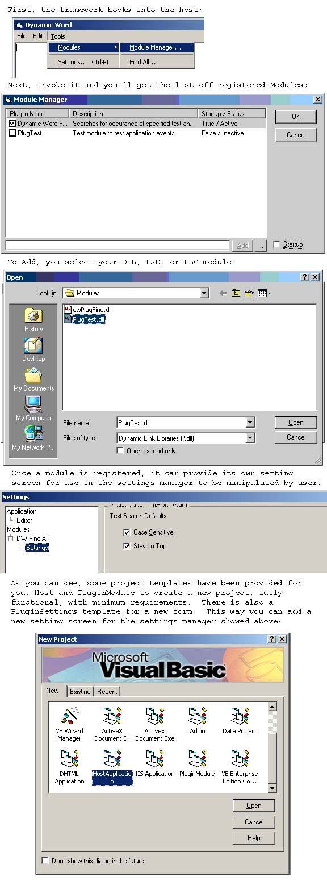



## A Complete Plug\-in Framework \(Update: 4 \(11/3/01\)\)

### Description

This is a reusable library that demonstrates how to use plugins. The application must have an object model (demonstrated) and the pluginutility DLL also has an object model, which really because a part of the application object model (demonstrated). The app sends events and the plugs have a configuration screen which becomes a part of the application. There is a complete module manager to deal with nitty gritty tasks for you. 1500-2000 lines of code.

Update 1: I cleaned this up a little. Should be easier to install. There is a new install.txt file. Added capability to add plugins to menu item, and finsished the FindText plug in. Be sure to check the Settings for the configuration of the plug defaults, you'll learn a lot. Bug Fixes, and the plugs are now early bound. This update should correct the problem mentioned in the feedback.

Update 2: Corrected the lock up problem. This only happened before the first plug is registered. Added two project types for templates in the VB Templates directory: HostApplicatoin, PluginModule. Read the Readme.txt. Those are so you can create a new host application from the new projects box, and a new plug for any supported host from the new project box. Added a PluginSettings form for the VB Form Templates so you can add a settings manager compliant form to you're project by choosing Forms->Add->PluginSetting. Other enhancements.

Update 3: Added a new plug-in, Autosave. Added some new events and functionality to the sample host application. Minor bug fixes such as correcting the ability to register a plug-in not in the default directory. Updated the project templates to reflect changes.

Update 4: Updated the display picture shown below:

Update 4b: Right-clicking a module in the module manager will now remove the reference to the plug-in, and unregister the DLL instance.

Read the Readme.txt file for more info. *** Please Vote For Me ***
 
### More Info
 

             |
---                |---
**Submitted On**   |2001-11-03 13:48:56
**By**             |[Shawn Bullock](https://github.com/Planet-Source-Code/PSCIndex/blob/master/ByAuthor/shawn-bullock.md)
**Level**          |Advanced
**User Rating**    |5.0 (389 globes from 78 users)
**Compatibility**  |VB 6\.0
**Category**       |[Libraries](https://github.com/Planet-Source-Code/PSCIndex/blob/master/ByCategory/libraries__1-49.md)
**World**          |[Visual Basic](https://github.com/Planet-Source-Code/PSCIndex/blob/master/ByWorld/visual-basic.md)
**Archive File**   |[A\_Complete330941132001\.zip](https://github.com/Planet-Source-Code/shawn-bullock-a-complete-plug-in-framework-update-4-11-3-01__1-25898/archive/master.zip)

